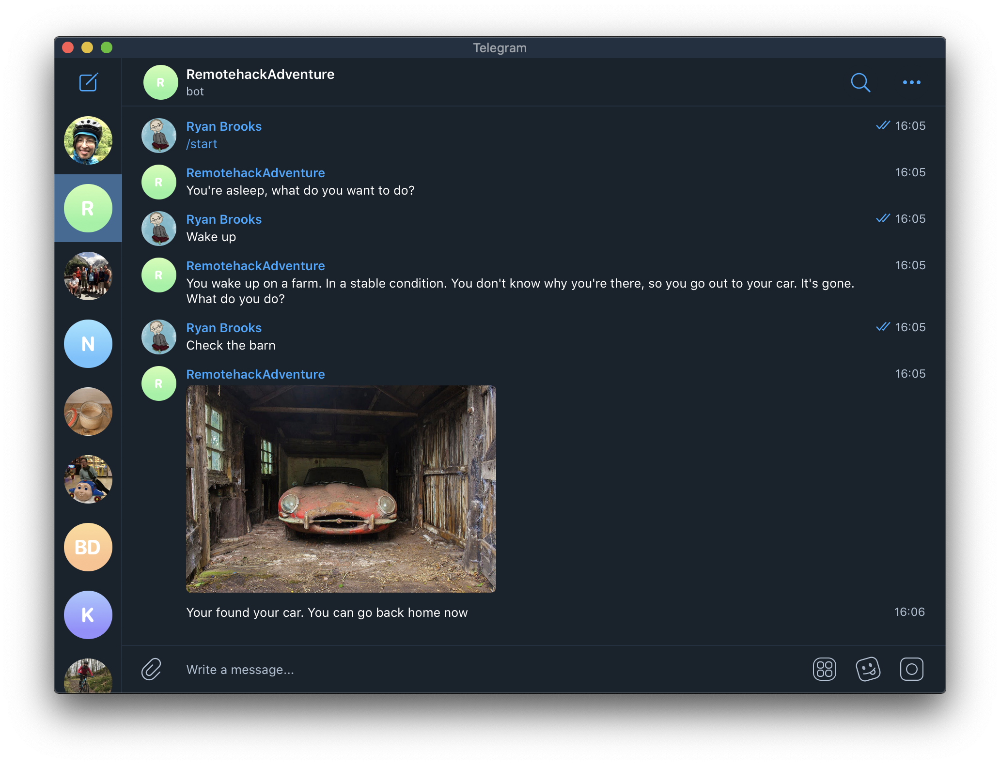

# telegram-adventure-story-bot

A Telegram bot with an intriguing story to tell



For the November Remote Hack we set about creating a Telegram bot to tell a story where you can choose how things progress.

## This has no tests! It's not production ready

Everything here was done for a hack day, but we learned a lot!

## To run the bot
You will need to update the bot name (which is currently hard-coded) to something unique.

```
set REMOTEHACK_TELEGRAM_BOT_TOKEN=xxxxxxxxxxxxxx
set REMOTEHACK_TELEGRAM_BOT_CREATOR_ID=xxxxxxxxxxx
gradlew run
```

## Creating a new bot

1. Start a conversation with the `BotFather` bot on Telegram, and create a bot.
2. Use the bot token from the BotFater as `REMOTEHACK_TELEGRAM_BOT_TOKEN`.
3. Update the code to use your bot's name here: https://github.com/remotehack/telegram-adventure-story-bot/blob/main/src/main/java/space/remotehack/RemotehackBot.java#L28
4. Send `/start` to the `@userinfobot` bot to retrieve your Telegram user ID.
5. Use the response to set you `REMOTEHACK_TELEGRAM_BOT_CREATOR_ID`.

# To do

- [ ] Update https://github.com/remotehack/telegram-adventure-story-bot/blob/main/src/main/java/space/remotehack/RemotehackBot.java#L28 to use an environment variable for the bot name, so it can be used by anyone.
- [ ] Make the tests work! 
- [ ] Add more tests 🤪
